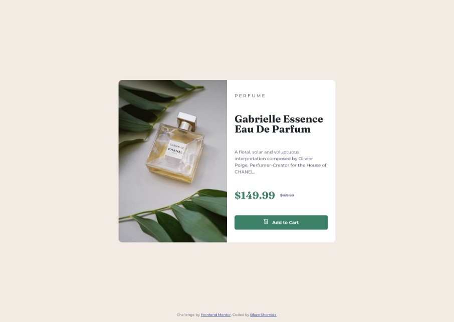
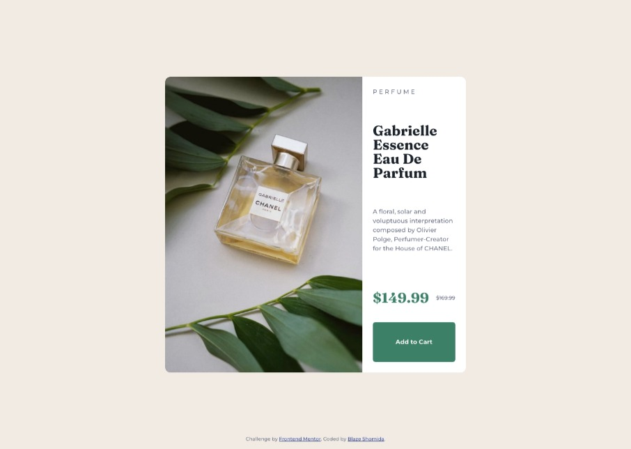

# Frontend Mentor - Product preview card component solution <!-- omit from toc -->

This is a solution to the [Product preview card component challenge on Frontend Mentor](https://www.frontendmentor.io/challenges/product-preview-card-component-GO7UmttRfa). Frontend Mentor challenges help you improve your coding skills by building realistic projects. 

Throughout this project, I encountered and overcame a number of challenges that tested my problem-solving skills and deepened my understanding of CSS. One particular hurdle, which I discuss in detail in the [What I Learned](#what-i-learned) section, involved the use of pseudo-elements.

Overall, this project was both challenging and enjoyable. It provided an excellent platform to experiment with new concepts like working with pseudo-elements and understanding the finer points of CSS hover effects and cursor styles. I look forward to carrying the lessons learned into future web development challenges.

## Table of contents <!-- omit from toc -->

- [Overview](#overview)
  - [The challenge](#the-challenge)
  - [My Solution](#my-solution)
- [My process](#my-process)
  - [Built with](#built-with)
  - [My Approach](#my-approach)
  - [What I learned](#what-i-learned)
  - [Continued development](#continued-development)
  - [Useful resources](#useful-resources)
- [Author](#author)

## Overview

### The challenge

Users should be able to:

- View the optimal layout depending on their device's screen size
- See hover and focus states for interactive elements

This challenge called for the implementation of a responsive design that adapts to varying screen sizes and provides appropriate interactive states for user interface elements. The project was an opportunity to apply and reinforce my understanding of essential web design principles, including media queries and CSS layout techniques such as Flexbox and Grid.

### My Solution

## My process

### Built with

- Semantic HTML5 markup
- CSS custom properties
- Flexbox
- CSS Grid

### My Approach

In tackling this project, I opted to base my work on the provided style guide instead of relying on the design files. This decision was made to challenge myself and broaden my design interpretation skills.

I initiated the process by examining the desktop design, recognizing that it generally possesses a more complex layout. My aim was to gain a clear understanding of the project's structure and content placement, which would aid in crafting the HTML.

Once the HTML content was in place, I shifted my focus to CSS for styling. I adopted a mobile-first strategy in my approach to CSS, which is often simpler to implement initially. I prioritized the development of a functional and aesthetic mobile layout, before progressively enhancing the design for larger screens using media queries.

This strategy ensures that my projects are accessible on a wide range of devices, taking into account the growing number of mobile users and the varying screen sizes that come with the multitude of devices available in today's market.

### What I learned

Through this project, I gained a deeper understanding of the `<source>` HTML tag and the `::before` and `::after` pseudo-elements in CSS.

I discovered that the `<source>` tag provides a way to alter images without the need for JavaScript. It allows the browser to choose the best-suited image based on the current viewing context, enhancing the responsiveness of the website.

In terms of CSS, I got to explore the use of `::before` pseudo-element to incorporate a cart icon into the "Add to Cart" button. While I could have used an `` tag, I decided to experiment with this approach after seeing someone else employ it. I found it particularly useful as it offers the flexibility to add the cart icon to any element by merely assigning the `.add-cart` class, thereby eliminating the need to manually insert the icon each time.

However, I did encounter a layout issue with the `.card` and `.card__content` elements. The problem arose when testing the desktop layout: the card image would take up most of the space, leaving the card content cramped. I traced this problem to the `grid-template-columns: auto 1fr;` property in the media query. I adjusted it to `grid-template-columns: 1fr 1fr;` to ensure an equal distribution of width between the image and the content.

Another issue was with the vertical expansion of the button on the desktop layout. I managed to resolve this by setting `.card__content` to `display: flex;` and modifying the flex direction to align with the design.

Below is a screenshot illustrating the layout issue I faced with the button:

### Continued development

Going forward, I plan to deepen my understanding and proficiency in a few key areas:

- **CSS Animations:** While I've been able to create some basic animations, I'm interested in exploring more complex ones, including transitions and keyframe animations. Understanding the nuances of timing, duration, and easing functions will be a critical part of this.

- **JavaScript Interactivity:** This project largely focused on HTML and CSS, but I'm keen on improving my JavaScript skills to add more interactive features to my future projects. In particular, I'd like to delve deeper into event handling, data manipulation, and utilizing APIs.

- **Accessibility:** I've used aria-labels in this project to improve screen reader compatibility, but I recognize that there's a lot more to learn about making web pages fully accessible. I aim to delve deeper into ARIA roles and properties, focus management, and more nuanced aspects of accessible design.

- **Performance Optimization:** As web pages become more complex, it's essential that they still load quickly and run smoothly. I want to learn more about techniques for minimizing file sizes, optimizing images, lazy loading, and other practices that can improve a website's performance.

I believe focusing on these areas will greatly enhance the quality of my future work and help me become a more well-rounded developer.
### Useful resources

- [W3 Schools - HTML `<source>` Tag](https://www.w3schools.com/tags/tag_source.asp) - This resource greatly clarified my understanding of the <source> tag and how to best leverage its attributes. It's a solid reference for anyone seeking to understand the usage and implementation of this tag.  
- [Before and After pseudo elements explained - part one: how they work](https://youtu.be/zGiirUiWslI) - This informative video was instrumental in helping me grasp the concept of pseudo-elements. It breaks down the topic into easily digestible segments, making it an excellent recommendation for those still coming to grips with this aspect of CSS.

## Author

- Github - [@blazeshomida](https://github.com/blazeshomida)
- Frontend Mentor - [@shomidamoney](https://www.frontendmentor.io/profile/yourusername)
